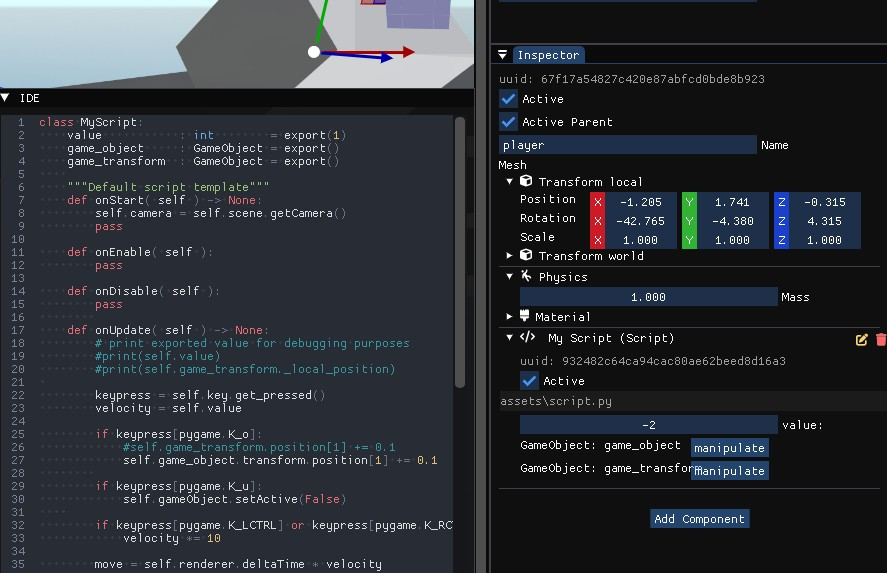
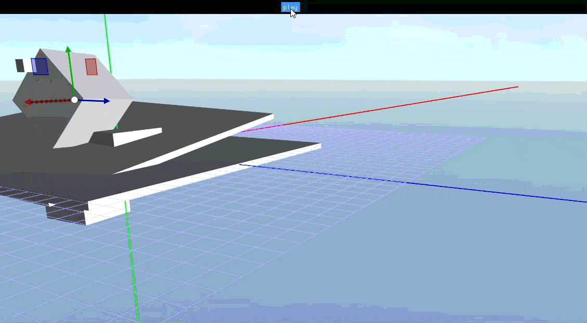
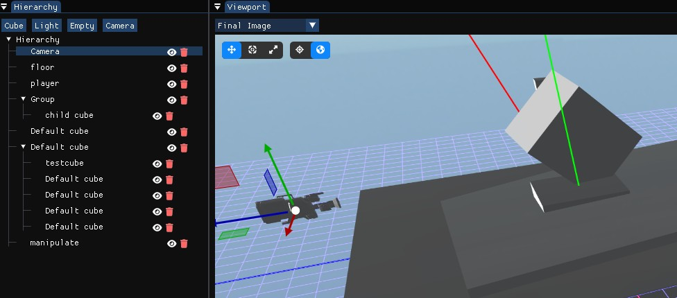

# Ember Engine 3D

Developed using ```Python```, ```OpenGL```, ```PyBullet```,```Pygame```, ```ImGui```, and ```Assimp/Impasse```.  
It demonstrates the core principles of interactive 3D rendering.

## :mortar_board: Built for educational purposes
3D Engines are rarely written in Python. –And for good reason.  
Python is interpreted, resulting in runtime overhead and efficiency loss

"How controversial it may be. it provides a nice way to explore engine design and development concepts hands-on.  
I value that as a good exercise!"

## :o: Features
- [x] - OpenGL Backend
- [x] - Script behaivior
- [x] - Integrated IDE
- [x] - PyBullet physics engine
- [x] - Binary export
- [x] - Editor UI (Hierarchy/Inspector/Console)
- [x] - Viewport Gizmos
- [x] - GPU Driven Render Pipeline using compute with legacy fallback
- [x] - Physical based rendering (layer visualization)
- [x] - Precedural OR Cubemap Skybox environment with reflections
- [x] - Serialized scenes (save/load)
- [x] - Simple shadowmapping and Fog
- [ ] - Cascaded shadowmapping
- [x] - FBX, GLB, OBj file support using Assimp

## :high_brightness: Showcase

https://github.com/user-attachments/assets/52a6dc86-628a-4592-92fe-6af80bde8c8c








## :fire: Installation (Windows)
Download [Release or Beta](https://github.com/mhoek2/EmberEngine/releases) here.

## Development
1. Install ```python``` from [the website](https://www.python.org/downloads/) ```*verified version: 3.12.7```
2. Create a directory, then [download](https://github.com/mhoek2/EmberEngine/archive/refs/heads/main.zip) and extract the codebase there.
3. Open a terminal in the fresh copy of the codebase and install the requirements
	```bash
	pip install -r requirements.txt
	```
4. Download binary dependency [Assimp](https://github.com/assimp/assimp/releases)
	1. Move ``Release\assimp-vc143-mt.dll`` from the ``zip`` to one of the PATH folders listed in your system variables
5. Open project folder in your preferred IDE and set main.py as startup item

### Build local docs
1. Open a terminal of your choice in the root of the codebase
2. Install sphinx and theme requirements
	```bash
	pip install sphinx sphinx-design myst-parser pydata-sphinx-theme
	```
3. Build the docs 
	```bash
	python -m sphinx -b html docs/source docs/build
	```
4. Open docs/build/index.html in the browser

## Older versions:
https://github.com/user-attachments/assets/7746df9e-e854-4730-9cb1-69f35433d842

https://github.com/user-attachments/assets/3027674b-0132-4761-9c3c-612fa972be97

## First version:

